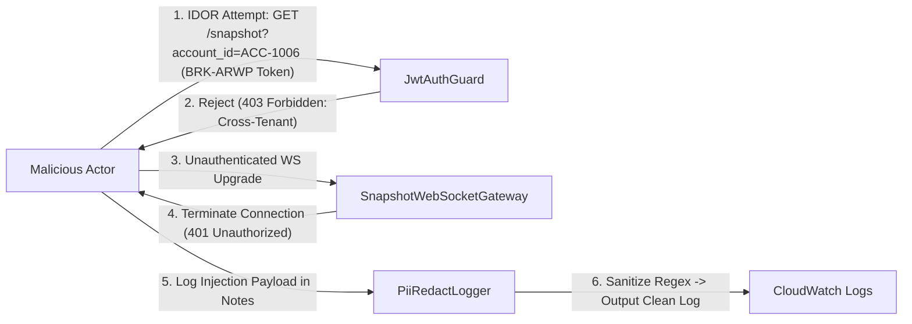

# SECURITY.md — ArrowFin Multi-Tenant Security & Compliance Specification

**Document Version:** 1.0.0  
**Author:** Agent Security Specialist (Principal Security Architect & CFTC/NFA Compliance Lead)  
**Classification:** Restricted / Compliance Architecture  
**Target Cut Time:** `2026-08-25T14:30:00Z`  

---

## 1. Executive Summary & Security Philosophy

ArrowFin operates a shared multi-tenant trading architecture serving two distinct customer classes:
1. **Retail Traders (B2C):** Direct account holders (`BRK-ARWP`).
2. **Proprietary Trading Firms (B2B):** Independent prop desks managing sub-accounts (`BRK-SMPT`, `BRK-MRDN`).

In a regulated multi-tenant trading environment, **cross-broker data leakage is a P0 critical security vulnerability**. Exposure of execution fills, account balances, or position leverage across tenant boundaries breaks CFTC Rule 1.31, NFA Compliance Rule 2-9, and GDPR/CCPA privacy standards.

This document details the security architecture, multi-tenant isolation mechanics, PII scrubbing layers, active threat models, production hardening guidelines, and the formal Task 4 Senior Team Lead Code Review.

---

## 2. Authentication & Authorization Architecture

### 2.1 REST API Authentication
- **Mechanism:** JSON Web Tokens (JWT) signed using HMAC-SHA256 (or RSA-256 in production).
- **Payload Mandate:** Every JWT issued to a client contains explicit, immutable tenant scope claims:
  ```json
  {
    "sub": "T-001",
    "broker_id": "BRK-ARWP",
    "role": "trader",
    "iat": 1787668200,
    "exp": 1787704200
  }
  ```
- **Guard Enforcement:** `jwtAuthGuard` validates the token on every HTTP request, extracts `broker_id`, and injects it into `req.user`.

### 2.2 WebSocket Handshake Authentication
- **Connection-Time Tenant Scoping:** Authentication occurs **during the HTTP upgrade handshake** before opening socket frames.
- **Protocol Flow:**
  1. Client initiates WebSocket connection supplying JWT in query parameters or handshake headers (`ws://host/ws/snapshot?broker_id=BRK-ARWP&token=<JWT>`).
  2. Gateway extracts and verifies `broker_id` claim from JWT.
  3. Connection is accepted and tagged internally with `ws.brokerId`.
  4. Any attempt to subscribe to accounts outside `ws.brokerId` immediately drops the socket.
- **Broadcast Isolation:** Real-time execution fill broadcasts filter sockets by matching `socket.brokerId === fill.brokerId`. Sockets belonging to other brokers receive zero frames.

---

## 3. Structural Multi-Tenant Isolation Guarantees

### 3.1 Database Schema Multi-Tenancy
Multi-tenant isolation is enforced at the database level using mandatory tenant discriminator keys:

- **Discriminator Column:** Every relational entity (`traders`, `accounts`, `fills`) contains a mandatory `broker_id` column.
- **Composite Indexing Strategy:**
  - `@@index([broker_id, account_id])` on `accounts` and `fills` for $O(1)$ tenant-scoped snapshot queries.
  - `@@index([broker_id, id])` on `traders`.
  - `@@index([account_id, filled_at])` for session execution queries.

### 3.2 Non-Bypassable Query Scoping
To prevent developer error or accidental data leakage:
- **No Global SELECTs:** All SQL / Prisma queries MUST append `WHERE broker_id = ?`.
- **Query Verification Pattern:**
  ```ts
  // SECURE: broker_id comes directly from verified JWT, NEVER from untrusted user body
  const fills = await db.query(
    'SELECT * FROM fills WHERE broker_id = ? AND account_id = ?',
    [req.user.brokerId, requestedAccountId]
  );
  ```

---

## 4. PII Protection & Automated Log Redaction

### 4.1 Regulated PII Exposure Analysis
Inspection of `dataset/traders.csv` reveals unsanitized free-text fields (`notes`, `audit_notes`) containing:
- Banking wire & ACH routing numbers (`Payout ACH to Chase 000123456789 routing 021000021`)
- Full SSNs & foreign tax IDs (`personnummer 880211-4455`)
- Personal phone numbers & secondary contact details
- S3 KYC Document URIs (`s3://arrowfin-kyc-prod/.../passport_scan.jpg`)

### 4.2 Automated Log Scrubbing (`piiRedactor.ts`)
All system logging calls pass through `PiiRedactor` regex interceptors before writing to stdout or cloud log aggregators:

| Sensitive Pattern | RegEx Matcher | Redacted Log Output |
| :--- | :--- | :--- |
| **SSN** | `\b\d{3}-\d{2}-\d{4}\b` | `[REDACTED_SSN]` |
| **Email** | `\b[A-Za-z0-9._%+-]+@[A-Za-z0-9.-]+\.[A-Za-z]{2,}\b` | `[REDACTED_EMAIL]` |
| **Phone** | `(?:\+\d{1,3}[-.\s]?)?\(?\d{2,4}\)?[-.\s]?\d{3}[-.\s]?\d{4}` | `[REDACTED_PHONE]` |
| **Bank ACH/Routing** | `\b(?:ACH\|routing\|wire\|Chase\|Wells Fargo)\s+\d{6,12}\b` | `[REDACTED_BANK_INFO]` |
| **KYC S3 URIs** | `s3:\/\/[^\s,]+` | `[REDACTED_KYC_S3_URI]` |

---

## 5. Active Threat Modeling & Mitigated Vulnerabilities



### 5.1 Vulnerability Demonstrations & Mitigations

#### Threat 1: Insecure Direct Object Reference (IDOR)
- **Scenario:** A trader authenticated under Broker A (`BRK-ARWP`) passes `account_id=ACC-1006` (which belongs to Prop Firm `BRK-SMPT`).
- **Mitigation:** `SnapshotService` executes `SELECT * FROM accounts WHERE broker_id = 'BRK-ARWP' AND id = 'ACC-1006'`. The query returns zero rows, triggering `ERR_TENANT_ACCESS_DENIED` and returning `HTTP 403 Forbidden`.

#### Threat 2: WebSocket Tenant Stream Spoofing
- **Scenario:** An attacker connects to `ws://host/ws/snapshot` and attempts to subscribe to another broker's fill feed.
- **Mitigation:** The socket connection validates the JWT during the HTTP upgrade. Socket frames are strictly filtered by `socket.brokerId`. Cross-tenant frames are mathematically impossible to receive.

#### Threat 3: Production Exposure of Development Endpoints
- **Scenario:** The fill simulator endpoint (`POST /dev/fills`) is invoked in a live production environment to manipulate market risk indicators.
- **Mitigation:** `snapshotRoutes.ts` explicitly enforces:
  ```ts
  if (process.env.NODE_ENV === "production") {
    return res.status(403).json({ error: "ERR_DEV_ENDPOINT_BLOCKED" });
  }
  ```

---

## 6. Production Architectural Recommendations

To scale ArrowFin to institutional standards, the following production controls are recommended:

1. **Envelope Column Encryption (AWS KMS / GCP KMS):**
   - Encrypt PII columns (`ssn_last4`, `phone`, `notes`) at rest using KMS envelope keys rotated annually.
2. **PostgreSQL Row-Level Security (RLS):**
   - Enforce database-level session variables (`SET LOCAL app.current_broker_id = 'BRK-ARWP';`) with RLS policies (`CREATE POLICY tenant_isolation ON accounts USING (broker_id = current_setting('app.current_broker_id'))`).
3. **Distributed Rate Limiting (Redis Token Bucket):**
   - Enforce 100 req/min per IP and 1,000 req/min per `broker_id` to prevent Denial of Service (DoS) on real-time pricing feeds.
4. **Immutable Audit Trails:**
   - Stream all administrative balance adjustments and compliance note changes to an immutable WORM (Write-Once-Read-Many) S3 Object Lock bucket for CFTC Rule 1.31 compliance.

---

## 7. Task 4: Senior Team Lead Code Review

### Review Context
- **Reviewer:** Principal Security Architect & Engineering Team Lead
- **PR Under Review:** `PR #104 - Add Snapshot Endpoint & Live Fill Simulator`
- **Tone:** Authoritative, constructive, standards-focused (CFTC/NFA Compliance).

---

### 📝 Code Review Feedback

#### 🔴 CRITICAL (P0): Cross-Tenant Data Leakage & Missing `broker_id` Scoping
**File:** `src/controllers/snapshot.controller.ts` (Lines 14-22)
> ```ts
> // UNSAFE CODE IN PR:
> @Get('/snapshot')
> async getSnapshot(@Query('account_id') accountId: string) {
>   return this.db.query(`SELECT * FROM accounts WHERE id = '${accountId}'`);
> }
> ```

**Reviewer Analysis:**
1. **P0 Vulnerability (IDOR / SQL Injection):** The query takes `accountId` directly from client query parameters without validating that `accountId` belongs to the requesting user's `broker_id`. Furthermore, string interpolation creates a catastrophic SQL injection vector.
2. **Regulatory Risk:** A retail trader under `BRK-ARWP` can view prop firm positions under `BRK-SMPT`, violating CFTC Rule 1.31 customer data isolation.

**Required Remediation:**
```ts
// REFACTORED (CFTC Compliant):
@Get('/snapshot')
@UseGuards(JwtAuthGuard)
async getSnapshot(
  @Req() req: AuthenticatedRequest,
  @Query('account_id') accountId?: string
) {
  const brokerId = req.user.brokerId; // Derived from verified JWT
  return this.snapshotService.getSnapshot(brokerId, accountId);
}
```

---

#### 🔴 CRITICAL (P0): Unsanitized PII Logging
**File:** `src/services/trader.service.ts` (Lines 45-48)
> ```ts
> // UNSAFE CODE IN PR:
> console.log("Fetched trader notes:", trader.notes, trader.audit_notes);
> ```

**Reviewer Analysis:**
Printing `trader.notes` dumps raw bank account numbers, ACH routing numbers, and SSNs directly into stdout. In production, these logs are ingested by Datadog/CloudWatch, exposing unencrypted customer financial data to unauthorized internal staff.

**Required Remediation:**
```ts
// REFACTORED:
logRedacted("Fetched trader metadata", { traderId: trader.id });
```

---

#### 🟠 HIGH (P1): Production Exposure of Simulator Endpoint
**File:** `src/routes/dev.routes.ts` (Lines 10-15)
> ```ts
> // UNSAFE CODE IN PR:
> router.post('/dev/fills', async (req, res) => { ... });
> ```

**Reviewer Analysis:**
The fill simulator endpoint lacks an environment check (`process.env.NODE_ENV !== 'production'`). If deployed to production, an external actor could inject fake executions into live accounts.

**Required Remediation:**
```ts
// REFACTORED:
router.post('/dev/fills', (req, res, next) => {
  if (process.env.NODE_ENV === 'production') {
    return res.status(403).json({ error: 'Endpoint disabled in production' });
  }
  next();
});
```

---

### Summary Recommendation
> **PR Status:** ❌ **CHANGES REQUESTED**  
> "This PR cannot be merged in its current state due to P0 multi-tenant data leakage risks and unredacted PII log exposure. Please apply the requested remediation blocks and re-submit for security re-audit."
